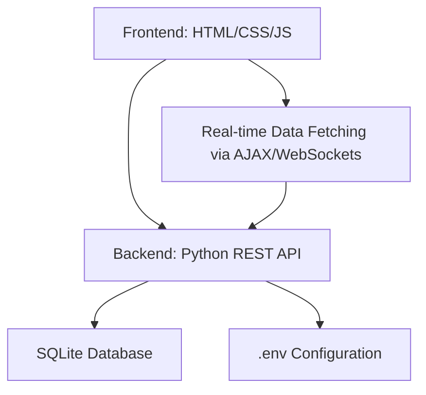

# Hotel Management System Design Document

## Overview
This design document outlines the architecture, database schema, API endpoints, and security considerations for a hotel management system. The system supports dynamic room management, customer reservations, employee roles, billing, and reporting. The backend is built with Python using a RESTful API, SQLite database, and .env for configuration. The frontend uses HTML, CSS, and JavaScript for a responsive, interactive UI with real-time data fetching.

## High-Level Architecture
The system follows a three-tier architecture: frontend (client-side), backend (server-side API), and database (data persistence).

- **Frontend**: Handles user interactions, displays data, and fetches updates in real-time using AJAX or WebSockets.
- **Backend**: Processes business logic, handles API requests, and interacts with the database.
- **Database**: Stores all system data with SQLite for relational integrity.
- **Configuration**: Uses .env for sensitive data like database credentials and API keys.

## Database Schema
The database uses SQLite with the following tables. All tables include standard fields like `id` (primary key, auto-increment), `created_at` (timestamp), and `updated_at` (timestamp).

### Tables
1. **rooms**
   - `room_number` (VARCHAR, UNIQUE): Unique identifier for the room.
   - `type` (VARCHAR): e.g., Single, Double, Suite.
   - `capacity` (INTEGER): Number of guests.
   - `price_per_night` (DECIMAL): Base price.
   - `status` (ENUM: available, occupied, maintenance): Current status.
   - `amenities` (JSONB): List of amenities (e.g., WiFi, TV).

2. **customers**
   - `first_name` (VARCHAR): Customer's first name.
   - `last_name` (VARCHAR): Customer's last name.
   - `email` (VARCHAR, UNIQUE): Contact email.
   - `phone` (VARCHAR): Contact phone.
   - `address` (TEXT): Full address.

3. **reservations**
   - `customer_id` (FOREIGN KEY to customers.id): Reference to customer.
   - `room_id` (FOREIGN KEY to rooms.id): Reference to room.
   - `check_in_date` (DATE): Reservation start.
   - `check_out_date` (DATE): Reservation end.
   - `status` (ENUM: pending, confirmed, checked_in, checked_out, cancelled): Reservation status.
   - `total_cost` (DECIMAL): Calculated total cost.
   - `special_requests` (TEXT): Optional notes.

4. **employees**
   - `first_name` (VARCHAR): Employee's first name.
   - `last_name` (VARCHAR): Employee's last name.
   - `email` (VARCHAR, UNIQUE): Work email.
   - `phone` (VARCHAR): Contact phone.
   - `role` (VARCHAR): e.g., Manager, Receptionist, Housekeeper.
   - `department` (VARCHAR): e.g., Front Desk, Maintenance.
   - `salary` (DECIMAL): Annual salary.
   - `hire_date` (DATE): Date of hire.

5. **invoices**
   - `reservation_id` (FOREIGN KEY to reservations.id): Reference to reservation.
   - `amount` (DECIMAL): Invoice amount.
   - `payment_status` (ENUM: unpaid, paid, refunded): Payment status.
   - `payment_date` (DATE): Date of payment (nullable).
   - `payment_method` (VARCHAR): e.g., Credit Card, Cash.

### Junction Tables
- **room_amenities** (if amenities are normalized): `room_id` (FK to rooms), `amenity_id` (FK to amenities table, if created separately). For simplicity, amenities are stored as JSONB in rooms table.

### Relationships
- One-to-many: customers to reservations, rooms to reservations, reservations to invoices.
- Many-to-one: reservations to customers/rooms, invoices to reservations.

## RESTful API Endpoints
The API uses REST principles with JSON responses. Base URL: `/api/v1`. Authentication via JWT tokens.

### Rooms
- `GET /api/v1/rooms`: List all rooms (with filters: status, type).
- `POST /api/v1/rooms`: Create a new room.
- `GET /api/v1/rooms/{id}`: Get room details.
- `PUT /api/v1/rooms/{id}`: Update room.
- `DELETE /api/v1/rooms/{id}`: Delete room.

### Customers
- `GET /api/v1/customers`: List all customers.
- `POST /api/v1/customers`: Create a new customer.
- `GET /api/v1/customers/{id}`: Get customer details.
- `PUT /api/v1/customers/{id}`: Update customer.
- `DELETE /api/v1/customers/{id}`: Delete customer.

### Reservations
- `GET /api/v1/reservations`: List all reservations (with filters: date range, status).
- `POST /api/v1/reservations`: Create a new reservation (validate room availability).
- `GET /api/v1/reservations/{id}`: Get reservation details.
- `PUT /api/v1/reservations/{id}`: Update reservation.
- `DELETE /api/v1/reservations/{id}`: Cancel reservation.

### Employees
- `GET /api/v1/employees`: List all employees.
- `POST /api/v1/employees`: Create a new employee.
- `GET /api/v1/employees/{id}`: Get employee details.
- `PUT /api/v1/employees/{id}`: Update employee.
- `DELETE /api/v1/employees/{id}`: Delete employee.

### Invoices
- `GET /api/v1/invoices`: List all invoices.
- `POST /api/v1/invoices`: Create a new invoice.
- `GET /api/v1/invoices/{id}`: Get invoice details.
- `PUT /api/v1/invoices/{id}`: Update invoice (e.g., mark as paid).
- `DELETE /api/v1/invoices/{id}`: Delete invoice.

### Reporting
- `GET /api/v1/reports/occupancy?start_date=YYYY-MM-DD&end_date=YYYY-MM-DD`: Room occupancy rates.
- `GET /api/v1/reports/revenue?start_date=YYYY-MM-DD&end_date=YYYY-MM-DD`: Total revenue.
- `GET /api/v1/reports/customer-stats`: Customer reservation statistics.

## Security Considerations
- **Authentication**: Use JWT tokens for API access. Implement login/logout endpoints.
- **Authorization**: Role-based access (e.g., admin for full CRUD, employee for limited access).
- **Data Protection**: Encrypt sensitive data (e.g., passwords hashed with bcrypt). Use HTTPS for all communications.
- **Input Validation**: Sanitize all inputs to prevent SQL injection and XSS.
- **Database Security**: Use parameterized queries, limit database user privileges.
- **API Security**: Rate limiting, CORS configuration, API versioning.
- **Configuration**: Store secrets in .env, never commit to version control.
- **Auditing**: Log API requests and database changes for compliance.